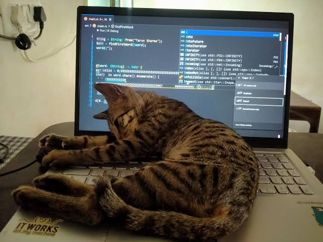

# 🚀 Proyecto: JavaScript Vainilla y GitHub (`mi-primer-js`)

¡Bienvenido/a a la documentación completa de mi primer proyecto en **JavaScript Vainilla** y **GitHub**! En este repositorio he recopilado el código, los ejercicios y la aplicación interactiva desarrollados paso a paso siguiendo la guía de aprendizaje.

---


## 📁 Estructura General del Repositorio

```text
mi-primer-js/
├── index.html            # Página de inicio con la vinculación general de scripts
├── README.md             # Documentación principal del repositorio
├── conceptos/            # Ejercicios prácticos de fundamentos
│   ├── variables.js      # Misión 2: Variables, constantes y tipos de datos
│   └── condicionales.js  # Toma de decisiones y lógica condicional
└── proyecto-final/       # App Integradora "Contador Dinámico"
    ├── index.html        # Interfaz de usuario con botones y pantalla
    └── app.js            # Selección del DOM, eventos y lógica del contador
```

---

## 💻 Resumen del Código Desarrollado

### 1. `conceptos/variables.js` (Fundamentos de Datos)
* **Variables y Constantes**: Uso estricto de `const` para valores inmutables (`nombreEstudiante`, `anioNacimiento`, `anioActual`) y `let` para datos mutables (`edadCalculada`, `estaConectado`).
* **Tipos Primitivos**: Implementación de cadias de texto (`String`), enteros (`Number`) y estados lógicos (`Boolean`).
* **Cálculo Dinámico**: Cálculo de la edad mediante la resta de años y salida organizada en la consola del navegador (`console.log`).

### 2. `conceptos/condicionales.js` (Estructuras de Control)
* **Evaluación de Flujo**: Uso de `if`, `else if` y `else` para categorizar usuarios según su edad (`edadUsuario`).
* **Operadores Lógicos y de Comparación**: Uso de `>=` (mayor o igual) y del operador de disyunción `||` (OR) para verificar acceso especial mediante permisos.

### 3. `proyecto-final/app.js` y `proyecto-final/index.html` ("Contador Dinámico")
* **Manipulación del DOM**: Captura de nodos HTML (`#valor`, `#btn-incrementar`, `#btn-restar`, `#btn-restablecer`) mediante `document.querySelector()`.
* **Manejo de Eventos**: Registro de clics en vivo con `.addEventListener('click', ...)` para incrementar, decrementar y reiniciar el estado del contador.
* **Estilos Dinámicos**: Función `actualizarColor()` que modifica la propiedad CSS `style.color` a verde para números positivos, rojo para negativos y neutro en cero.

---




## 🛠️ Herramientas y Flujo de Trabajo en Git/GitHub

Para subir todos los archivos y cambios creados en esta sesión a GitHub, sigue este flujo de comandos en la terminal de Visual Studio Code:

```bash
# 1. Consultar el estado de los archivos nuevos y modificados
git status

# 2. Agregar todos los archivos al área de preparación (Staging)
git add .

# 3. Guardar una captura de los cambios con un mensaje explicativo
git commit -m "Feat: Agrego conceptos de JS y la app del contador dinámico"

# 4. Enviar todos los commits locales a la rama principal de GitHub
git push origin main
```

---
*Proyecto desarrollado como práctica de fundamentos de programación web sin frameworks ni librerías externas.*